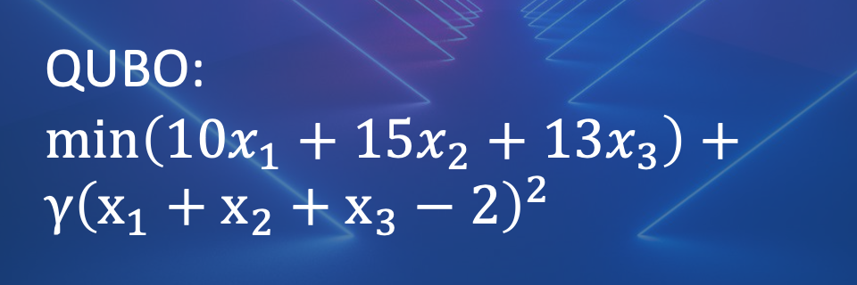

# QUBO-lifecycle
Demonstrates what happens when you send a QUBO to the D-Wave QPU

## Overview

This program takes a 3-variable QUBO function and demonstrates what goes on 
"behind the scenes" as it runs on the QPU.  We see:

1. The original QUBO.
2. The equivalent Ising form.
3. The Ising form embedded onto the QPU architecture using four qubits.
4. A scaled version of the embedded Ising form that is the final QMI.

The problem is run on the D-Wave QPU.  When a solution is 
returned, we see:

5. The QMI solution (embedded Ising solution).
6. The unembedded Ising solution, with any chain breaks resolved.
7. The equivalent unembedded QUBO solution.

Note that we use the default chain strength value in this program (value of 1).  

## Exercise 1

Run the program as is (hit return (enter) to continue to the next 
output as the program runs).

The output is as follows:

> QUBO:
> |      |      |      |
> |------|------|------|
> | -91  | 72   | 72   |
> | 0    | -87  | 72   |
> | 0    | 0    | -89  |
> 
> [Hit enter to continue at each step]
>
> Converting QUBO to Ising ...
>
> Ising:
> |      |      |      |
> |------|------|------|
> | -9.5  | 18.0  | 18.0   |
> | 0    | -7.5  | 18.0   |
> | 0    | 0    | -8.5  |
>
> Embedding logical problem into physical layout ...
>
> QMI (unscaled):
> |      |      |      |    |
> |------|------|------|----|
> | -9.5  | 18.0  | 0   | 18.0    |
> | 0    | -7.5  | 18.0   | 0   |
> | 0    | 0    | -4.25  | -24.0   |
> | 0    | 0    | 0  | -4.25   |
>
> Scaling physical problem by 24.0 ...
>
> QMI (scaled):
> |      |      |      |    |
> |------|------|------|----|
> | -0.4  | 0.75  | 0   | 0.75    |
> | 0    | -0.31  | 0.75   | 0   |
> | 0    | 0    | -0.18  | -1.0   |
> | 0    | 0    | 0  | -0.18  |
>
>
> Sending problem to QPU...
>
> Best QMI solution found:
>
> {1: np.int8(1), 2: np.int8(-1), 3: np.int8(1), 4: np.int8(1)}
>
> Converting QMI solution to Ising ...
>
> Best Ising solution found:
>
> {1: np.int8(1), 2: np.int8(-1), 3: np.int8(1)}
>
> Converting Ising solution to QUBO ...
>
> Best QUBO solution found:
>
> {1: np.int8(1), 2: 0, 3: np.int8(1)}

## Exercise 2
Consider the following 3-boxes problem.

Problem:

Pick the pair of boxes with the smallest sum.

As a QUBO, this is written:

Write down your new QUBO, with the Lagrange parameter set to 24.

> $10x_1 + 15x_2 + 13x_3 + 24(x_1 +x_2+x_3-2)^2$

## Exercise 3
Do the algebra, and write down your new QUBO.

> $-62x_1-57x_2-59x_3+48x_1 x_2+48x_1 x_3+48x_2 x_3+96$

## Exercise 4
In the program for this unit, replace the entries of your Q matrix, with 
the values from your new QUBO. Run the program. Check through the results, and make sure that you understand them,
compared to what you found in the first step.

The output is as follows:

> QUBO:
> |      |      |      |
> |------|------|------|
> | -62  | 48   | 48   |
> | 0    | -57  | 48   |
> | 0    | 0    | -59  |
> 
> [Hit enter to continue at each step]
>
> Converting QUBO to Ising ...
>
> Ising:
> |      |      |      |
> |------|------|------|
> | -7.0  | 12.0  | 12.0   |
> | 0    | -4.5  | 12.0   |
> | 0    | 0    | -5.5  |
>
> Embedding logical problem into physical layout ...
>
> QMI (unscaled):
> |      |      |      |    |
> |------|------|------|----|
> | -7.0  | 12.0  | 0   | 12.0    |
> | 0    | -4.5  | 12.0   | 0   |
> | 0    | 0    | -2.75  | -24.0   |
> | 0    | 0    | 0  | -2.75   |
>
> Scaling physical problem by 24.0 ...
>
> QMI (scaled):
> |      |      |      |    |
> |------|------|------|----|
> | -0.29  | 0.5  | 0   | 0.5    |
> | 0    | -0.19  | 0.5   | 0   |
> | 0    | 0    | -0.11  | -1.0   |
> | 0    | 0    | 0  | -0.11  |
>
>
> Sending problem to QPU...
>
> Best QMI solution found:
>
> {1: np.int8(1), 2: np.int8(-1), 3: np.int8(1), 4: np.int8(1)}
>
> Converting QMI solution to Ising ...
>
> Best Ising solution found:
>
> {1: np.int8(1), 2: np.int8(-1), 3: np.int8(1)}
>
> Converting Ising solution to QUBO ...
>
> Best QUBO solution found:
>
> {1: np.int8(1), 2: 0, 3: np.int8(1)}

## License

Released under the Apache License 2.0. See [LICENSE](LICENSE) file.
